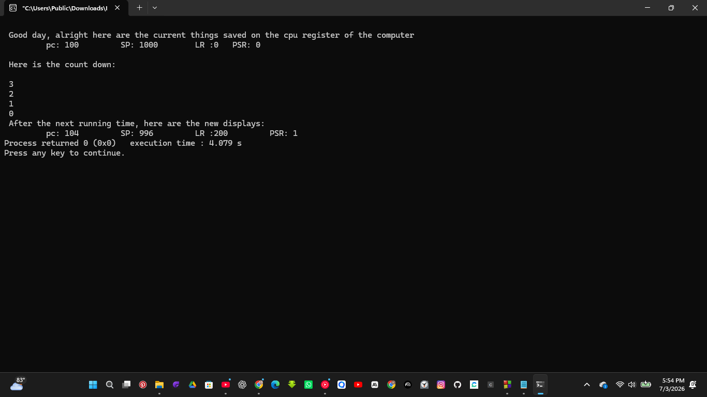

# CPU Register Simulator

## Overview

This project is a simple simulation of the four main CPU registers using the C programming language. Since a normal C program cannot directly access the actual hardware registers inside a processor, I used integer variables to represent them and demonstrate how their values change during program execution.

The purpose of this project is to build a practical understanding of how CPU registers work and the role each register plays during instruction execution.

---

## Project Objective

The objectives of this project are to:

* Simulate the four main CPU registers using C variables.
* Assign initial values to each register.
* Display the initial register values.
* Simulate changes to the register values during execution.
* Observe how CPU registers are updated as a program runs.

---

## CPU Registers Used

### Program Counter (PC)

The Program Counter stores the address of the next instruction that the processor should execute. In this simulation, the PC starts at **100** and is later updated to **104** to represent moving to the next instruction.

### Stack Pointer (SP)

The Stack Pointer keeps track of the top of the stack. It starts at **1000** and is updated to **996**, representing a stack operation during execution.

### Link Register (LR)

The Link Register stores the return address after a function call. In this project, it changes from **0** to **200** to simulate saving a return location.

### Program Status Register (PSR)

The Program Status Register stores information about the processor's current status. It changes from **0** to **1**, representing a change in the processor's status after an operation.

---
## Project code

[Click Here to check out the project code](code)

## How the Program Works

The program begins by declaring four integer variables that represent the CPU registers:

* Program Counter (PC)
* Stack Pointer (SP)
* Link Register (LR)
* Program Status Register (PSR)

Each register is assigned an initial value, and these values are displayed on the screen.

The program then updates the register values to simulate CPU activity.

```text
PC  : 100  → 104
SP  : 1000 → 996
LR  : 0    → 200
PSR : 0    → 1
```

Before displaying the updated register values, the program performs a short countdown. This delay simply represents that some processing has taken place before the registers are updated.

Finally, the updated values of all four registers are displayed.

---
## Project Output Image



## Program Flow

```text
Start
   │
   ▼
Declare CPU Registers
   │
   ▼
Assign Initial Values
   │
   ▼
Display Initial Register Values
   │
   ▼
Update Register Values
   │
   ▼
Countdown Simulation
   │
   ▼
Display Updated Register Values
   │
   ▼
End
```

---

## Project Demo video

[Click here to check out the Demo Video](video/cpu_register_simulator_project1_video.mp4)

## Sample Output

```text
Here is the current saved details in the register:

PC : 100
SP : 1000
LR : 0
PSR : 0

Here is the countdown:

3
2
1
0

After the next running time, here are the new displays:

PC : 104
SP : 996
LR : 200
PSR : 1
```

---

## What I Learned

This project helped me understand that CPU registers are small and very fast storage locations inside the processor.

While building this simulator, I learned that:

* The **Program Counter (PC)** keeps track of the next instruction to execute.
* The **Stack Pointer (SP)** points to the top of the stack.
* The **Link Register (LR)** stores the return address after a function call.
* The **Program Status Register (PSR)** keeps information about the processor's current status.

Although this project is only a software simulation, it gave me a better understanding of how these registers work together during program execution and strengthened my understanding of basic computer architecture concepts.

---

## Possible Improvements

Some improvements that could be added in future versions include:

* Simulating additional CPU registers.
* Adding memory simulation.
* Executing instructions automatically instead of manually updating register values.
* Allowing users to modify register values through a menu.
* Expanding the project into a simple CPU emulator.

---

## Technologies Used

* **Programming Language:** C
* **Compiler:** GCC
* **Concepts Covered:**

  * CPU Registers
  * Computer Architecture
  * Program Execution
  * Register Simulation
  * Embedded Systems Fundamentals

---

## Conclusion

This project successfully demonstrates the basic operation of four important CPU registers using a simple C program. It provides a practical way to understand how register values change during execution and serves as a solid foundation for learning more advanced topics such as instruction execution, stack management, branching, and processor architecture.
